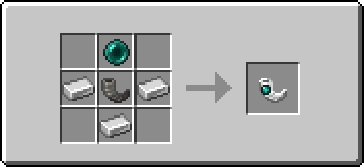
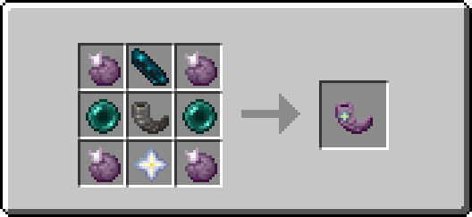

<p align="center">
  
</p>

<h1 align="center">PolyHorn</h1>

<p align="center">
  <strong>Teleportation horns - use them to teleport to your spawn point or to a saved location.</strong>
</p>

<p align="center">
  <a href="https://github.com/RenardElectric/polyhorn/actions/workflows/build.yml"></a>
  
  
  
  <a href="LICENSE"></a>
</p>

<p align="center">
  <a href="#what-you-can-do">What you can do</a> ·
  <a href="#start-playing">Start playing</a> ·
  <a href="#crafting-recipes">Recipes</a> ·
  <a href="#server-administrators">Server admins</a> ·
  <a href="#developers">Developers</a>
</p>

PolyHorn is a server-side Fabric mod that adds two unstackable teleportation horns with different
destinations: your respawn point and a return point stored directly inside a Horn of Return.

> [!NOTE]
> **Just joining an existing PolyCard server?** You can ignore the
> [server administrator](#server-administrators) and [developer](#developers) sections.

## What you can do

|                                                                               | Horn               | Functionality                                                                                      | Controls                                                       |
|-------------------------------------------------------------------------------|--------------------|----------------------------------------------------------------------------------------------------|----------------------------------------------------------------|
|  | **Horn of Origin** | Teleport to your current respawn point.                                                            | Right-click while holding it.                                  |
|  | **Horn of Return** | Save a personal destination inside that horn, then return to it later—even from another dimension. | Sneak and right-click to save; right-click normally to return. |

- A Horn of Return remembers its dimension, coordinates and viewing direction in the item itself.
- Its lore shows the saved coordinates and dimension after a return point is set.
- Right-clicking a horn displayed in an item frame activates it without removing it.
- Successful teleports reset fall distance, play a teleport sound and start a shared horn cooldown.
- Both horns have survival crafting recipes and can also be issued through an administrative command.
- Spectators cannot activate horns.

## Start playing

### Joining a multiplayer server

1. Add the server in Minecraft and connect as usual.
2. Accept its resource pack when Minecraft asks. This small download supplies the horn textures.
3. Craft a horn using one of the recipes below or get one from a server administrator.
4. Open chat and run `/polyhorn help` whenever you need the available command list.

If cards have missing textures, ask the server administrator whether the PolyCard resource pack is
correctly set up.

### Playing in singleplayer

Singleplayer runs its own local server, so PolyHorn must be installed in your Fabric game instance.
Follow [Installing PolyHorn](#installing-polyhorn).

### Using the horns

- **Horn of Origin:** right-click to teleport to your respawn point.
- **Horn of Return:** sneak and right-click once to record your current location. Right-click normally
  whenever you want to return there.
- **Item frames:** right-click a framed horn without sneaking to activate it.
- **Cooldown:** both horn types share the same cooldown. The default is 100 ticks, or 5 seconds.

> [!TIP]
> The return point belongs to the individual horn item, not to the player. Different Horns of Return
> can therefore hold different destinations.

## Crafting recipes

<details open>
<summary><strong>Horn of Origin</strong></summary>


```text
· E ·
I H I
· I ·
```

- `H` — Goat Horn
- `E` — Ender Pearl
- `I` — Iron Ingot

</details>

<details open>
<summary><strong>Horn of Return</strong></summary>


```text
C E C
P H P
C S C
```

- `H` — Goat Horn
- `C` — Chorus Fruit
- `E` — Echo Shard
- `P` — Ender Pearl
- `S` — Nether Star

</details>

### Player commands

| Command          | What it does                                                  |
|------------------|---------------------------------------------------------------|
| `/polyhorn`      | Show the installed PolyHorn version, authors and description. |
| `/polyhorn help` | List the commands available to you.                           |

---

## Server administrators

This section is for people installing PolyHorn in singleplayer or running a multiplayer server. Players
joining an existing server can return to [Start playing](#start-playing).

### Requirements

| Component     | Current requirement                      |
|---------------|------------------------------------------|
| PolyHorn      | `1.0.3`                                  |
| Minecraft     | `26.2`                                   |
| Java          | `25` or newer                            |
| Fabric Loader | `0.19.3` or newer                        |
| Fabric API    | `0.158.0+26.2` or newer compatible build |

### Installing PolyHorn

1. Install Java 25.
2. Install the Minecraft 26.2 version of [Fabric Loader](https://fabricmc.net/use/) for your game or
   dedicated server.
3. Open that game instance or server directory and create a folder named `mods` if it is not present.
4. Download [Fabric API](https://modrinth.com/mod/fabric-api) and place its JAR in the `mods` folder.
5. Download PolyHorn from [GitHub Releases](https://github.com/RenardElectric/polyhorn/releases) and
   place its main JAR in the same `mods` folder.
6. Start the game or server.

For singleplayer, follow these steps in the Fabric Minecraft instance you intend to play. For a
multiplayer server, install PolyHorn and Fabric API on the server; connecting players do not need the
PolyHorn JAR.

### Client textures

> [!IMPORTANT]
> Gameplay is server-side, but players still need PolyHorn's textures. Configure the server to offer a
> matching resource pack and ask players to accept it when joining. Without the pack, horns can show
> missing textures.

[Polymer can include another mod's assets](https://polymer.pb4.eu/latest/user/resource-pack-custom-assets/)
in its generated resource pack and can host that pack through
[AutoHost](https://polymer.pb4.eu/latest/user/resource-pack-hosting/). Polymer is an optional server
tool and is not bundled with PolyHorn.

### Configuration

The horn cooldown is shared by both horn types and stored with the world. Twenty game ticks are
approximately one second.

| Setting         |                 Default |     Allowed range | Persistence     |
|-----------------|------------------------:|------------------:|-----------------|
| `horn_cooldown` | `100` ticks (5 seconds) | `0`–`10000` ticks | Saved per world |

PolyHorn has no separate configuration file. Read or change the value in-game with the commands below.

### Administrative commands

| Command                                  | What it does                                                   |
|------------------------------------------|----------------------------------------------------------------|
| `/polyhorn config horn_cooldown`         | Show the current cooldown in ticks.                            |
| `/polyhorn config horn_cooldown <value>` | Set the cooldown from 0 to 10,000 ticks.                       |
| `/polyhorn give <players> <hornType>`    | Give one or more players `horn_of_origin` or `horn_of_return`. |

These commands use Minecraft's **Gamemasters** permission level. All arguments provide tab completion.

### Stored data

- The cooldown configuration is persistent world data under PolyHorn's `config` entry.
- Each Horn of Return stores its own destination as a vanilla item with custom data.
- Back up the world as usual before removing the mod or moving a save between incompatible versions.

---

## Developers

### Building from source

#### Prerequisites

- Git
- JDK 25
- No system Gradle installation is required; the repository includes the Gradle 9.7 wrapper.

Clone the repository:

```bash
git clone https://github.com/RenardElectric/polyhorn.git
cd polyhorn
```

Generate data before building so generated recipes and item models match the Java definitions.

<details open>
<summary><strong>Windows PowerShell</strong></summary>

```powershell
.\gradlew.bat runDatagen --stacktrace
.\gradlew.bat build --stacktrace
```

</details>

<details>
<summary><strong>Linux / macOS</strong></summary>

```bash
chmod +x ./gradlew
./gradlew runDatagen --stacktrace
./gradlew build --stacktrace
```

</details>

Build artifacts are written to `build/libs/`. GitHub Actions follows the same sequence: `runDatagen`
first, then `build`.

### Repository layout

| Path                                       | Purpose                                                                         |
|--------------------------------------------|---------------------------------------------------------------------------------|
| `src/main/java/polycube/polyhorn`          | Horn definitions, teleportation behavior, commands and persistent configuration |
| `src/client/java/polycube/polyhorn/client` | Data generation entrypoint and generated item-model helpers                     |
| `src/main/resources`                       | Fabric metadata, access widener, textures and packaged assets                   |
| `.github/workflows`                        | Build and release automation                                                    |
| `.github/scripts`                          | Shared CI metadata, release and summary scripts                                 |

Before submitting a change, run both build commands above and confirm there are no errors.

## Authors and license

PolyHorn is made by **RenardElectric** and **Timeo** for the PolyCube Team.

This project is available under the [MIT License](LICENSE).
